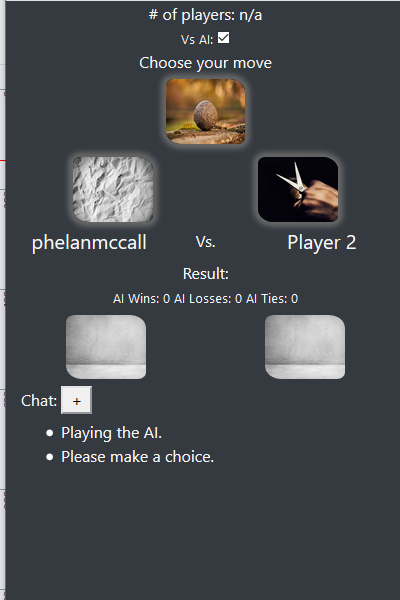
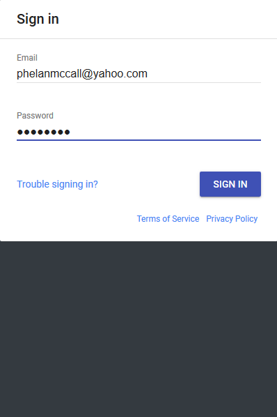
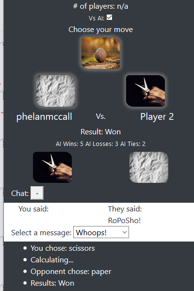
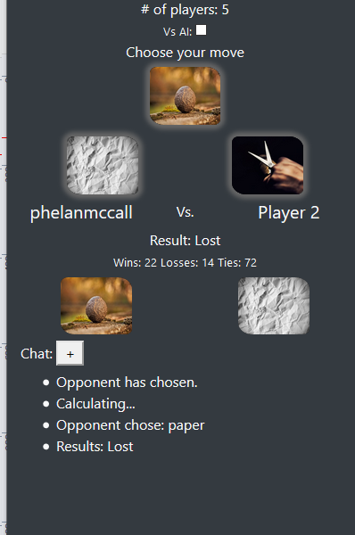
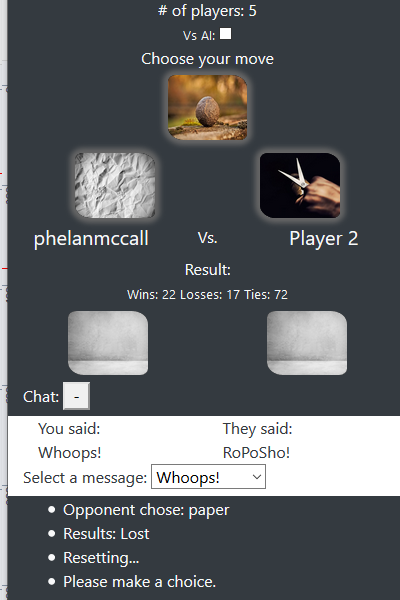

# RoPoSho

[https://phelanmccall.github.io/roposho](https://phelanmccall.github.io/roposho)

Rock, Paper, Scissors multiplayer game.

Built with jQuery and a Firebase database.

You have to log in to play so your score can be saved.

## Single Player

- You can play the AI while the "Vs AI" box is checked.

## Multiplayer

- Uncheck the "Vs AI" box.

- Once 2 players or more are connected, you will be matched with an available player. 

- Pick Rock, Paper or Scissors 

- Wait for your opponent to pick

- The winner will be evaluated

- Your score will be updated.

- Choose a message to display to your opponent.

- The console on the bottom will log the events of the connection and game.
