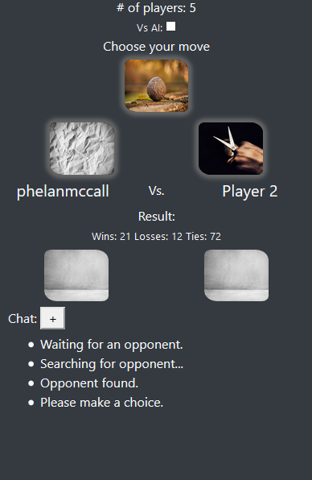
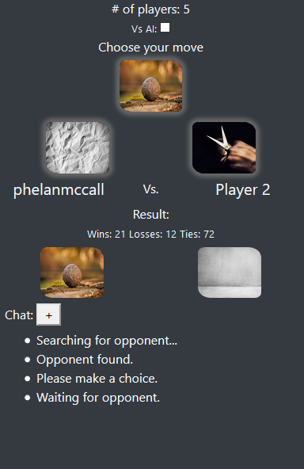
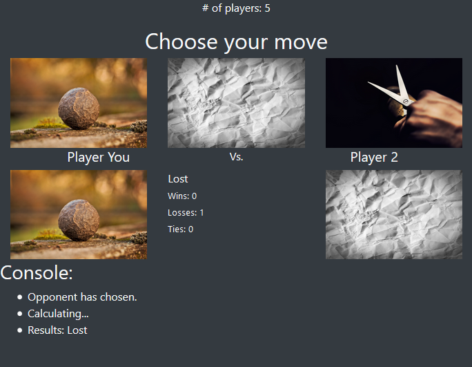

# RPS

Rock, Paper, Scissors multiplayer game.

Built with jQuery and a Firebase database.

## Multiplayer

1. Go to https://mougatrah.github.io/RPS

2. Once 2 players or more are connected, you will be matched with an available playet.

3. Pick Rock, Paper or Scissors 

4. Wait for your opponent to pick

5. The winner will be evaluated

6. Your session score will be updated.

- The console on the bottom will log the events of the connection and game.
